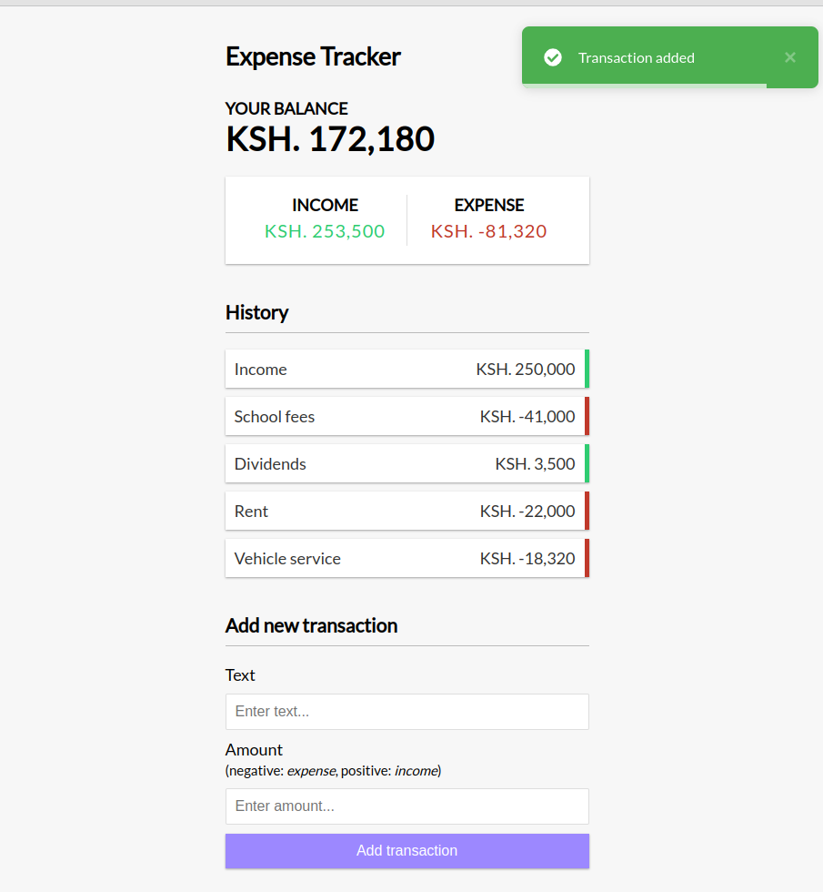

# Vue Expense Tracker

A simple expense tracker built in Vue JS using the `composition` API along with the `script setup` syntax. Data is stored in local storage. This is from a tutoarial video by [Brad Traversy](https://youtu.be/hNPwdOZ3qFU)

## Screenshot



## Recommended IDE Setup

[VSCode](https://code.visualstudio.com/) + [Volar](https://marketplace.visualstudio.com/items?itemName=Vue.volar) (and disable Vetur) + [TypeScript Vue Plugin (Volar)](https://marketplace.visualstudio.com/items?itemName=Vue.vscode-typescript-vue-plugin).

## Customize configuration

See [Vite Configuration Reference](https://vitejs.dev/config/).

## Project Setup

```sh
npm install
```

### Compile and Hot-Reload for Development

```sh
npm run dev
```

### Compile and Minify for Production

```sh
npm run build
```
